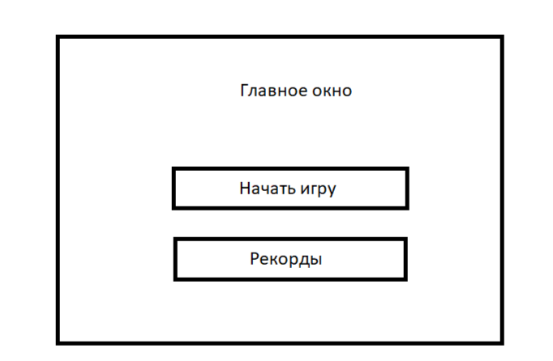
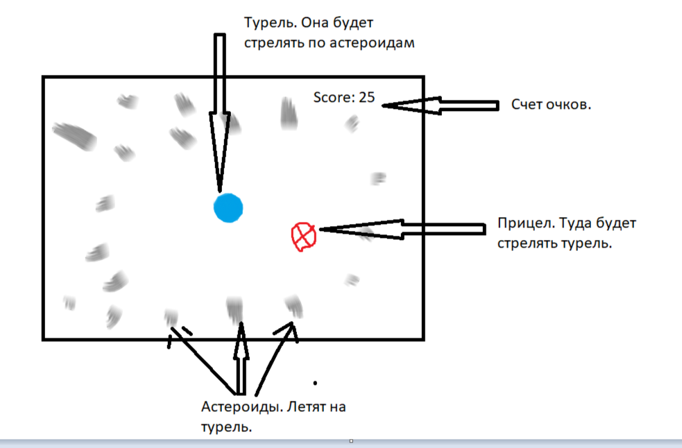

# Техническое задание

1. Project Name: Универсальный планировщик
2. Authors:
    - Team Lead: Челноков Егор
    - Project Developers: Беликов Андрей, Советов Егор
    - Teacher: Анатольев Алексей Владимирович
3. Description of the program.
    
      >- Основной сюжет игры заключается в том, чтобы космическая турель уничтожала астероиды, летящие в нее.
      >- В стартовом меню пользователь может начать новую игру или посмотреть таблицу рекордов.
      >- Если турель столкнулась с астероидом, то игра завершается и пользователю предлагается начать игру заново или выйти.
         Его результат сохраняется в бд.
      >- Пользователь может передвигать турель вправо-влево на игровом поле. Стрельба происходит автоматически.
      >- Турель может попадать по астероидам и они будут исчезать. Если турель столкнется с астероидом, игра закончится.
      >- Игра будет сопровождаться звуковыми эффектами во время стрельбы турели и уничтожения метеоритов.
4.
5.
6. Graphical interface.

     Графический интерфейс будет реализован средствами Pygame.
     
     
     